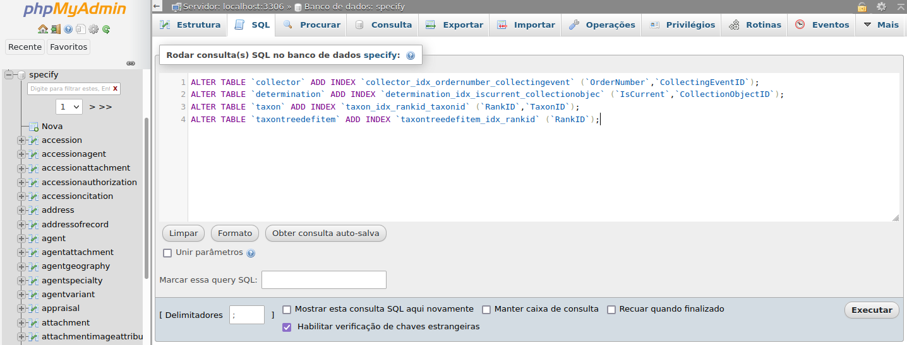

# Otimizações para o SpeciesLink - Usando Técnicas de ___DATA MINING___

O [spLinker](http://splink.cria.org.br/splinker) é um aplicativo desenvolvido pelo [Cria](cria.org.br) que possibilita os gestores de coleções enviar os dados de suas coleções para a [SpeciesLink](specieslink.net) base de dados gerida pelo Cria.

Mesmo que você não use o **spLinker** ou precise de otimizações, as técnicas aqui utilizadas, ___data mining___ e scripts podem serem úteis como inspiração pra lidar com problemas semelhantes.

## Porque foram feitas essas otimizações e se você pode usá-las
Na instalação do Splinker é criada uma consulta SQL para obter os dados do Specify 
que atendam os requisitos (Dados -> Darwincore) para ser enviado ao cria. Testou e funcionou, no entanto conforme foi crescendo a coleção o tempo de consulta passar aser cada vez maior, chegando a muitas horas, mais de 6h até, assim usando técnicas de data mining, recriamos a consulta para que fosse mais rápida.
Assim, os arquivos aqui disponíveis foram desenvolvidos para otimizar o envio dos dados ao SpeciesLink, dividindo o SQL em duas fases, e de preparo de tabelas temporárias e a consulta (técnica de mineração "__data mining__" de dados SQL). 

Essas otimizações tiveram como base o software de gestão de coleções [Specify](https://www.specifysoftware.org/) para uma coleção de peixes. Possivelmente possa funcionar com outros tipos de coleções geridas pelo Specify. Porém, para tanto é necessário avaliar. Dúvidas, sugestões, problemas ? Basta submeter um issue, que irei responder.

## Software onde foi aplicada a otimização
Para enviar os dados, o [spLinker](http://splink.cria.org.br/splinker) faz uma consulta a base de dados (MYSQL) do Specify, mapeando para o modelo de dados [Darwincore](http://splink.cria.org.br/digir/darwin2.xsd). Tal consulta é definida por um comando único SQL que fica armazenado no arquivo **query.sql** na pasta **config** do ___spLink___. As otimizações realizadas foram feitas quando a consulta (SQL) a base de dados do Specify.

## Resultados
Para a base de dados com mais de 20mil specimens no Specify, a consulta passapu de mais de 10h para menos de 5minutos. Ou seja uma **melhora que chegou a mais de  100 (cem) vezes**, ou seja mais **100.000%.**

## Implantar as otimizações
- Passo 1: * ***FAZER BACKUP*** 

Método 1 - **Automático** - Preferido

Execute o **specify-sql.py** que esta na pasta **config**, que ele irá verificar os arquivos existentes pedir dados de acesso se necessário e em seguida chamar o **spLinker**

>> **ATENÇÃO!!!!** Para executar o **specify-sql.py** é necessário ter o python3 instalado no seu Sistema Operacional e ter o pacote ___mysql-connector-python___ instalado.

Para instalar esse pacote python execute:
```bash
# caso python3 seva a versão principal
python -m pip install mysql-connector-python

ou 
# se houver mais de um python e a versão 3 não for a principal
python3 -m pip install mysql-connector-python
```

Edite o arquivo **specify.db** que copiou para sua pasta config do spLinker para refletir a instalação do seu Specify.
```
user = seu_specify_it_user
passwd = sua_senha_it_user
```

>Vá aonde esta instalado o spLinker e acesse a ___pasta config___. Então faça uma copia de segurança do arquivo **query.sql** para **query-original.sql** ou outro nome que preferir.

- Passo 2: ___COPIAR ARQUIVOS DE INSTALAÇÃO___
>Copie todos arquivos da pasta **install** deste repositório para a pasta **config** de sua instalação do splinker.
São eles: [query.sql](/arquivos/query.sql), [cria-temp.sql](/install/cria-temp.sql), [index.sql](/install/index.sql), [specify-sql.py](/install/specify-sql.py)


- Passo 3: * ***CRIAR ÍNDICES NO BANCO DE DADOS DO SPECIFY***

Método 1 - **Manualmente**:
>Para tanto utilize o conteúdo do [index.sql](/install/index.sql) para executar sobre a base de dados do specify, usando um software de gestão de banco de dados, ou diretamente pelo mysql cliente. No exemplo abaixo usamos o phpmyadmin.



Método 2 - **Automático**: - Preferido
Use o script python **specify-sql.py** para executar o **spLinker** ao invés de executar o **spLinker**, que criar os índices em sua primeira execução. Se precisar refazer, basta apagar o arquivo **instalado.ini** da pasta **config**

- Passo 4 (Avançado): * ___COMPARAR query.sql___  
>Você pode verificar se a consulta SQL a sua base de dados Specify é igual a que foi usada para fazer a otimização, copiando e colando o conteúdo de sua **query.sql** e da nossa [query-original.sql](/arquivos/query-original.sql) no site de comparação [www.textcompare.org/sql](https://www.textcompare.org/sql/) e verificar se são semelhantes. Coleções de peixes usando o Specify, provavelmente usam a mesma **query.sql**. Dúvidas ou se precisar de ajuda, submeta um ___issue___ relatando sua situação.

## Utilizando as Otimizações
A otimização criada executa dois comandos SQL, os quais poderiam estar juntos no **query.sql** separados por **ponto-e-vírgula**, que é sintaxe utilizada para separar comandos no SQL. No entanto, por uma limitação do **spLinker**, ele só aceita apenas um comando SQL no arquivo **query.sql**. Desta forma, para desviar dessa limitação, dividimos a execução em desses comandos em duas etapas. A primeira é executa pelo usuário usando o SQL **cria-temp.sql** sobre a base de dados do Specify, e a segunda **query.sql** é a que o **spLinker** executa antes de enviar os dados.

Para tanto temos três formas de fazer isso:
1. - **Automático:** - _Preferido_
>Executar o **specify-sql.py** ao invés de chamar o **spLinker**, que ira preparar a execução das otimizações automáticamente.
2. - **Manualmente:** Executar o primeiro comando SQL **cria-temp.sql** sobre a base de dados do Specify, copiando e colando o conteúdo. Como feito no **Passo 1** e depois execute o **spLinker**
